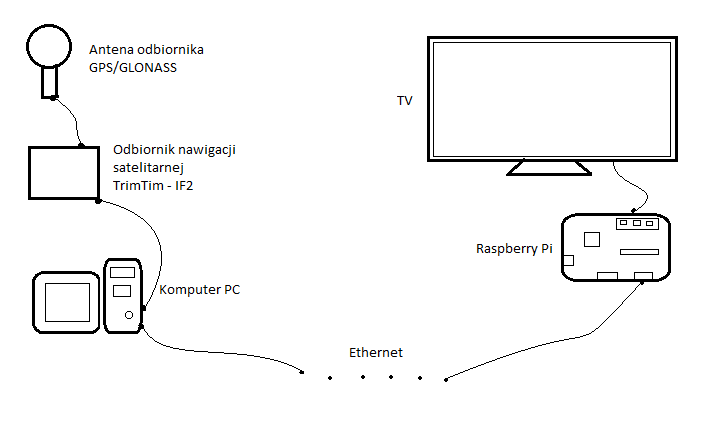

# Python_Image_Capture

Project consist of two programs. 

First (client) instaled on device number 1.
Program capture chosen fragments of the other programm and sending it by internet with frequency of 1 sec.

Second (server, becouse I start connect here) installed on device number 2. 
Then another device receive it and insert to our graphical interface.

Python 3.7.2
I used socket, tkinter, ImageTk, ImageGrab, time

In this case I capture date and satellites map from dedicated program to operate anntena(program Trimble company).
Next Raspberry Pi recives it and after changes sends to TV. 
It was student project that show all students on the hole a actual position of satellite.

